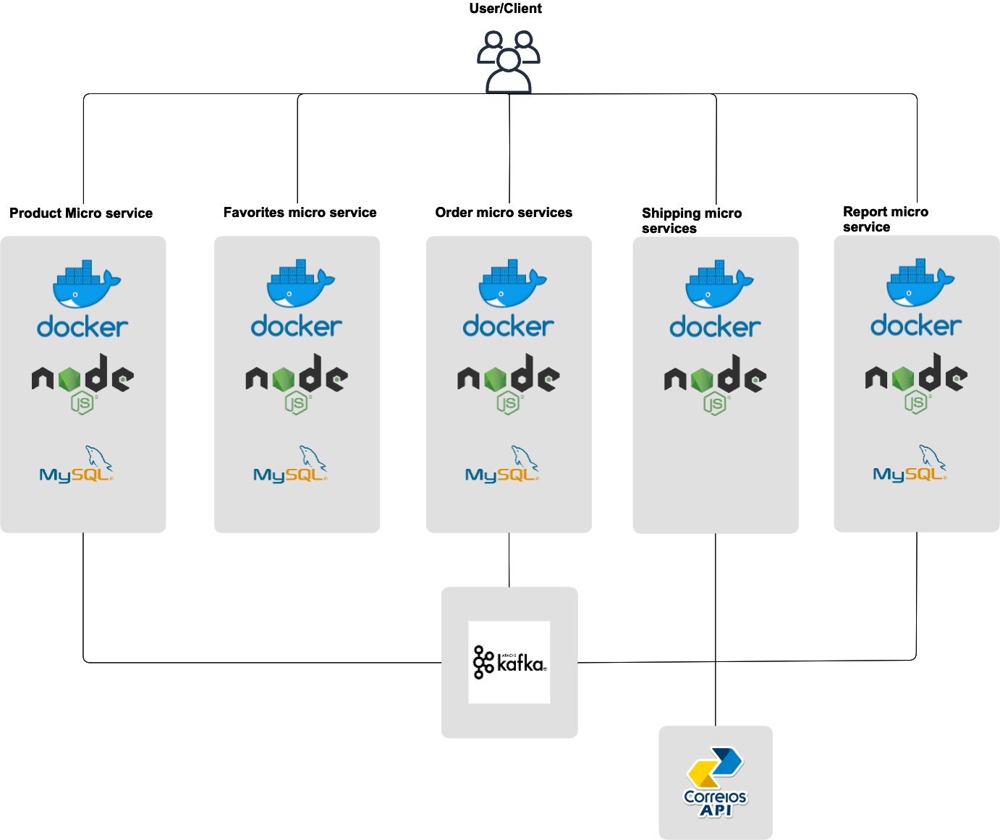

# Micro-Services-Example
Build Amazon Application using Micro services architecture.



## Setup

### Prerequisite

> Docker

> Node >= 14 (to run locally - without docker)

To install all project, follow these steps:

1. ./scripts/start-kafka.sh
2. ./scripts/create-topics.sh
3. ./scripts/run-daemons.sh

#### Warning

If step `3` fails, please try:

1. ```cd ./microservices/Fiap-favorites-services && docker-compose run -d mysql nodejs ```
2. ``` cd ./microservices/Fiap-order-services && docker-compose run -d mysql nodejs ```
3. ``` cd ./microservices/Fiap-product-services && docker-compose run -d mysql nodejs ```
4. ```cd ./microservices/Fiap-report-services && docker-compose run -d mysql nodejs ```
5. ``` cd ./microservices/Fiap-shipping-services && docker-compose run -d mysql nodejs ```

Or follow each micro service README.

## Run migrations

### Inside each ./microservices

Inside docker or with mysql configured in you machine, run:

> `./node_modules/knex/bin/cli.js migrate:latest --esm`

## Run seeds

### Inside each ./microservices

Inside docker or with mysql configured in you machine, run:

> `./node_modules/knex/bin/cli.js seed:run --esm`

## Technologies

1. 🛠 - Javascript - Programming language
2. 🚀 - Express - Server framework
4. 📦 - Mysql - Data base/Repository
3. ⚙️ - knex - ORM for mysql
4. ⚒️ - node-rdkafka - Kafka abstraction lib
5. ✉️ - AVSC - Buffer parser
6. 🔮 - Node-config - Configuration file lib (from environment and yml)
7. 🧨 - Opossum - Lib for Circuit breaker
