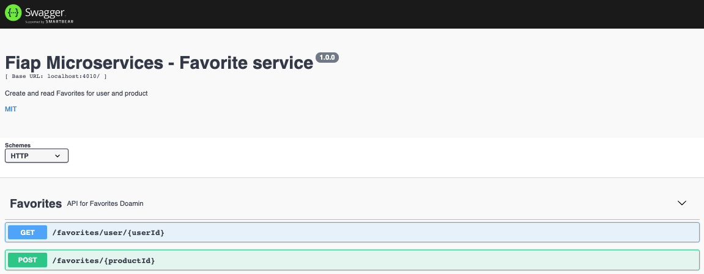

# Fiap-favorite-service

### Domain
From Favorite domain, created a micro service to expose their functionalities

### Setup

## Prerequisite

> Docker
> Node >= 14

To install all project, follow:

### Locally

1. npm install
2. npm run dev

### From docker
2. docker-compose up -d mysql nodejs

### Run migrations

Inside docker or with mysql configured in you machine, run:

> `./node_modules/knex/bin/cli.js migrate:latest --esm`

### Run seeds

> `./node_modules/knex/bin/cli.js seed:run --esm`

### Technologies

1. Javascript - Programming language
2. Express - Server framework
4. Mysql - Data base/Repository
3. knex - ORM for mysql
4. node-rdkafka - Kafka abstraction lib
5. AVSC - Buffer parser
6. Node-config - Configuration file lib (from enviroment and yml)

### Swagger

API Documentation follow `OpenApi`:
## Url

http://localhost:4010/api-docs/#/

