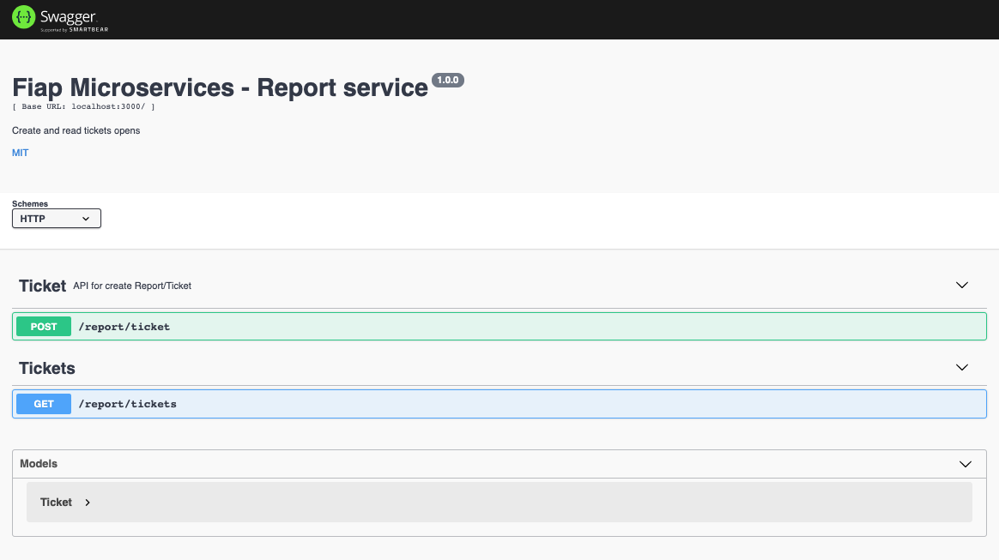

# Fiap-report-service

### Domain
From Report domain, created a micro service to expose their functionalities

### Setup

## Prerequisite

> Docker
> Node >= 14
> Kafka from docker network or locally (../README.md)

To install all project, follow:
### Locally

1. npm install
2. npm run dev

### From docker
1. ./scripts/create-topic-ordered.sh
2. ./scripts/create-topic-viewed.sh
3. docker-compose up -d mysql nodejs

### Run migrations

Inside docker or with mysql configured in you machine, run:

> `./node_modules/knex/bin/cli.js migrate:latest --esm`

### Run seeds

> `./node_modules/knex/bin/cli.js seed:run --esm`

### Technologies

1. Javascript - Programming language
2. Express - Server framework
4. Mysql - Data base/Repository
3. knex - ORM for mysql
4. node-rdkafka - Kafka abstraction lib
5. AVSC - Buffer parser
6. Node-config - Configuration file lib (from enviroment and yml)

### Running 

#### Inside docker

1. docker-compose up

### Locally

1. npm start

### Swagger

API Documentation follow `OpenApi`:
#### Url

http://localhost:3009/api-docs/#/

