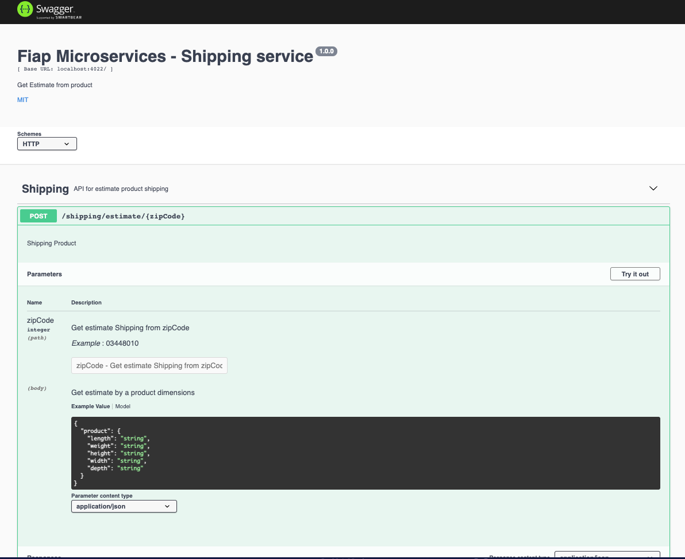

# Fiap-shipping-service

### Domain
From Shipping domain, created a micro service to expose their functionalities

## Setup

### Prerequisite

> Docker
> Node >= 14

To install all project, follow:
### Locally

1. npm install
2. npm run dev

### From docker
1. docker-compose up -d nodejs

## Technologies

1. Javascript - Programming language
2. Express - Server framework
3. Correios-brasil - Connection lib to Correios XML API.
4. Opossum - CB Lib
5. Node-config - Configuration file lib (from environment and yml)

### Swagger

API Documentation follow `OpenApi`:
#### Url

http://localhost:4022/api-docs/#/

